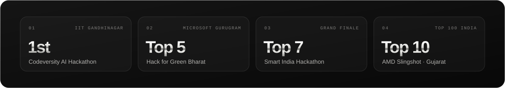
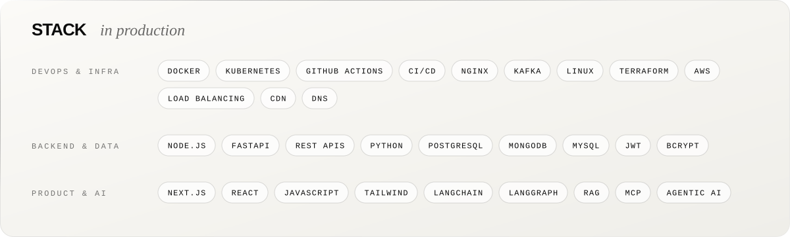
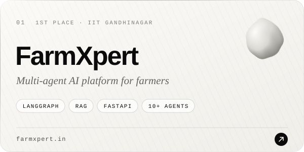
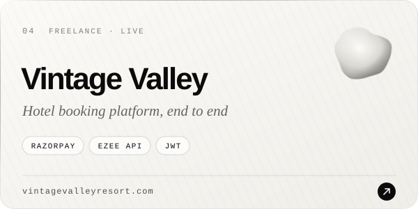
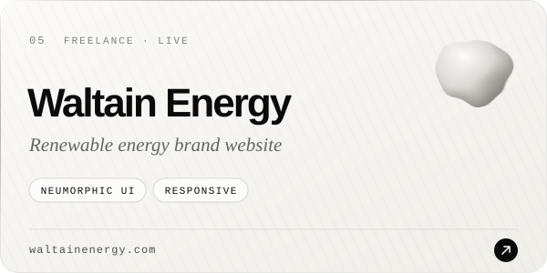
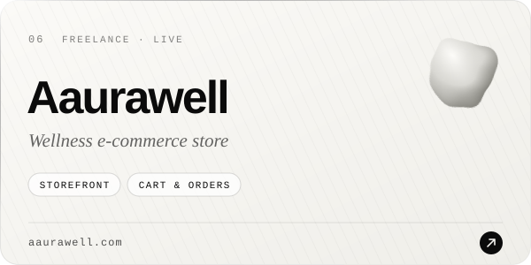

  

  
  
  

 

### `$ whoami`

I **ship production systems and keep them alive** under live traffic.

- **DevOps** — Docker, CI/CD with GitHub Actions, Nginx, Kafka, Linux, load balancing, CDN & DNS
- **Full-stack** — Next.js, React, Node.js, FastAPI, PostgreSQL, MongoDB
- **Agentic AI** — LangChain, LangGraph, RAG and MCP, running in production, not just notebooks
- **Freelance** — four client platforms live on real traffic, built and deployed end to end
- **Student** — B.E. ICT at VGEC Ahmedabad (2023 – 2027)

 

  

  

 

### `$ kubectl get projects`

<table>
  <tr>
    <td width="50%"></td>
    <td width="50%"></td>
  </tr>
  <tr>
    <td width="50%"></td>
    <td width="50%"></td>
  </tr>
  <tr>
    <td width="50%"></td>
    <td width="50%"></td>
  </tr>
</table>

 

### `$ git log --graph`

  <picture>
    <source media="(prefers-color-scheme: dark)" srcset="https://raw.githubusercontent.com/Dhrumil-Kharadi/Dhrumil-Kharadi/output/snake-dark.svg" />
    <source media="(prefers-color-scheme: light)" srcset="https://raw.githubusercontent.com/Dhrumil-Kharadi/Dhrumil-Kharadi/output/snake.svg" />
    
  </picture>

  <code>uptime 99.9% · open to DevOps, platform & full-stack roles</code>

