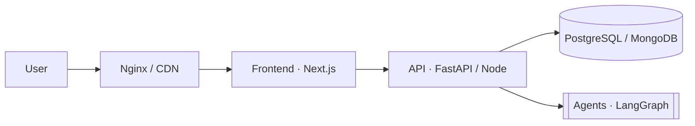

<!--
  README template for each pinned project.
  1. Replace everything in [BRACKETS].
  2. Add a screenshot: drag an image into the GitHub editor, it gives you a link.
  3. Delete any section that doesn't apply.
-->

<div align="center">

# [PROJECT NAME]

**[One-line pitch - what it does and for whom.]**

[]([https://domain.com])
[](#)


</div>

## ✦ Overview

[2–3 sentences: the problem, who uses it, and what makes your solution different.]

## ✦ Features

- **[Feature]** - [what it does / why it matters]
- **[Feature]** - [what it does / why it matters]
- **[Feature]** - [what it does / why it matters]

## ✦ Architecture



## ✦ Tech stack

| Layer | Tech |
| --- | --- |
| Frontend | [Next.js, React, Tailwind] |
| Backend | [FastAPI / Node.js, REST] |
| Data | [PostgreSQL / MongoDB] |
| AI | [LangChain, LangGraph, RAG] |
| Infra | [Docker, GitHub Actions, Nginx, Hostinger / Vercel] |

## ✦ Run locally

```bash
git clone https://github.com/Dhrumil-Kharadi/[REPO].git
cd [REPO]
cp .env.example .env      # fill in your keys
docker compose up --build # or: npm install && npm run dev
```

## ✦ What I built

- [Your specific contribution - e.g. "designed the 10-agent LangGraph orchestration"]
- [Production work - e.g. "set up CI/CD, Nginx reverse proxy, zero-downtime deploys"]

---

<div align="center">
<sub>Built by <a href="https://github.com/Dhrumil-Kharadi">Dhrumil Kharadi</a> · DevOps & Full-Stack</sub>
</div>
